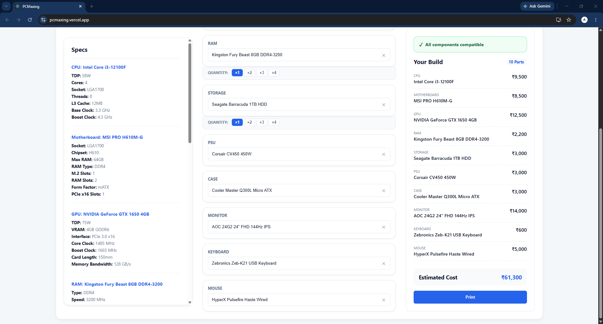
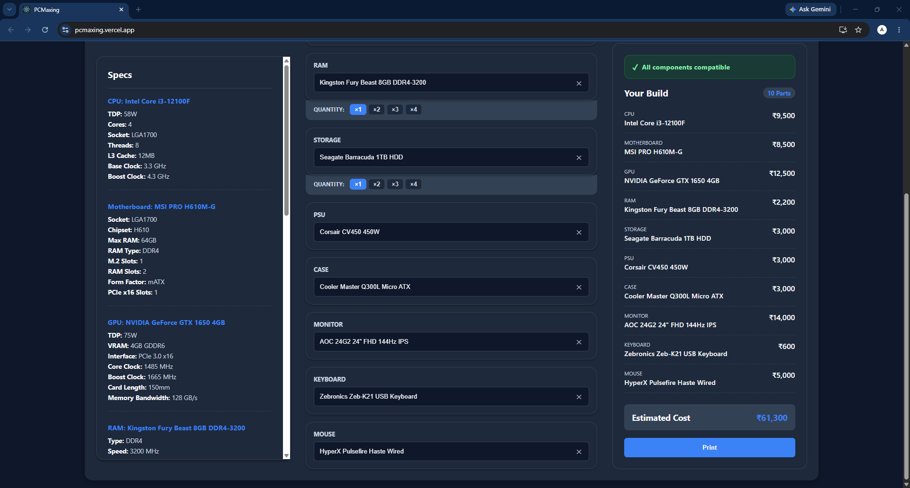

# PCMaxing.com
## PC Design web app with real time pricing and component compability checks.
Built with Express.js, React.js, Typescript, MySQL. 
Deployed using AWS. 
Other tools used: Git, Kubernets, Docker, Jetbrains Datagrip, MS VS Code

Deployed at: [https://pcmaxing.vercel.app/](https://pcmaxing.vercel.app/)

PCMaxing a web app to help you design your own custom computer. Select components easily using the active search boxes with quick suggesstions. Latest pricing and current tally is updated instantly using latest data cached in the MySQL Database. Component Compatibility checks ensure that the selected components are compatible with each other. Smooth and interactive UI with dark mode further enhances the user experience. Print functionality allows to print the data in current instance as a invoice

Screenshots:

Invoice Printer Demo: [Sample Invoice](sampleInvoidPrint.pdf)